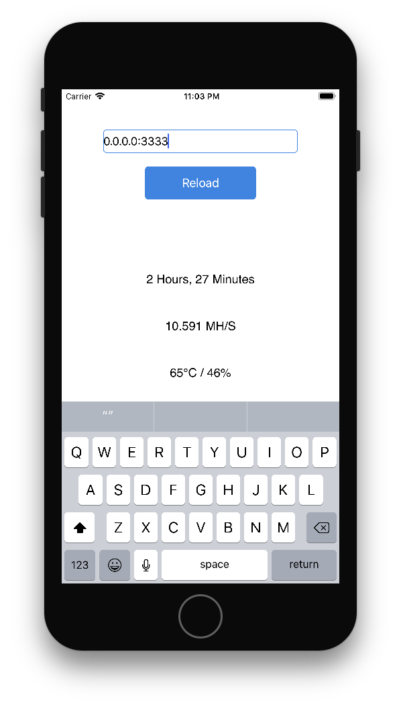

# Claymore-GPU-Miner-iOS-Monitor
A iOS client monitor providing basic information of Claymore GPU miner program

### Written in Swift 3

## Features

- Show MH/s
- Show worker working time
- Show GPU percentage and temperature

More about Claymore remote menager:

## Example

## Installation

### Method 1
1. Download source project from github
2. Build the project by xcode into your iDevice

You can find out how to build and launch app on your iDevice in [Appls's tutorial](https://developer.apple.com/library/content/documentation/IDEs/Conceptual/AppDistributionGuide/LaunchingYourApponDevices/LaunchingYourApponDevices.html)

### Method 2
- Download ipa in released page
- Resign the ipa by [Cydia impactor](http://www.cydiaimpactor.com/) or [iModSign](http://mac.softpedia.com/get/Developer-Tools/iModSign.shtml) (required developer account)
- Install resigned ipa into your iDevice by iTunes or [ifunbox](http://www.i-funbox.com/)

## Usage
1. Open Claymore miner in your console
2. Connect to your miner by filled ip in iOS app textfield
3. Press reload
4. It shows the basic information of your miner.

## Future Work
- More information

### Feel free to contact me by opening issue